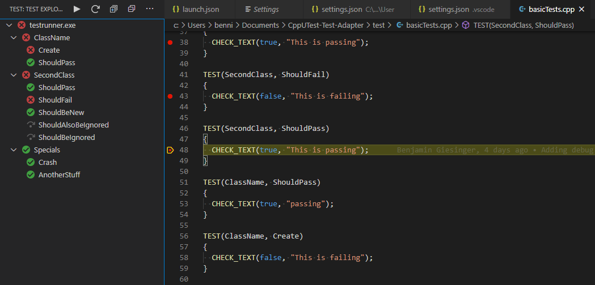

# CppUTest Test Adapter for Visual Studio Code

[](https://github.com/bneumann/CppUTest-Test-Adapter/actions/workflows/unit_tests.yml)

This is the implementation for a [CppUTest](https://cpputest.github.io/) Test Adapter for VSCode. Check it out on the VSCode Market Place: [CppUTest Adapter](https://marketplace.visualstudio.com/items?itemName=bneumann.cpputest-test-adapter)

<a href="https://ko-fi.com/B0B836FAL"></a>



## Setup

To let this plugin know where your tests are set the ```cpputestTestAdapter.testExecutable``` to the executable of your tests. They are separated by semicolon and support wildcards, so you can add as many executables as you want:
```
{
  "cpputestTestAdapter.testExecutable": "${workspaceFolder}/test/testrunner;${workspaceFolder}/test/subFolder/ut_*",
  "cpputestTestAdapter.testExecutablePath": "${workspaceFolder}/test"
}
```
They will be executed in the ```cpputestTestAdapter.testExecutablePath``` path.

To arrange for a task to be run prior to running tests or refreshing the test list, set ```cpputestTestAdapter.preLaunchTask``` to the name of a task from tasks.json. This can be used to rebuild the test executable, for example.

### Logging Configuration

To enable debugging and troubleshooting, configure the logging options:
```json
{
  "cpputestTestAdapter.logpanel": true,
  "cpputestTestAdapter.logfile": "${workspaceFolder}/logs/cpputest-adapter.log"
}
```

- ```logpanel```: Shows logs in VSCode's Output panel ("CppUTest Test Adapter Log")
- ```logfile```: Saves logs to a file. Recommended extensions: ```.log```, ```.txt```

If you want to use the debugging functions you will also need to setup a launch.json file with your debugger path and arguments etc. The adapter will take care of the rest. Hopefully.


